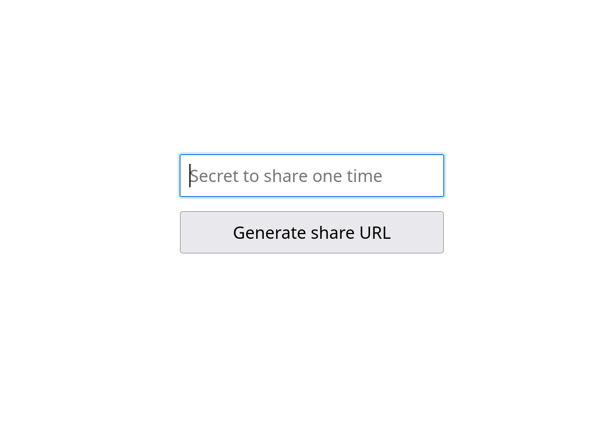

TODO

# OneTimeSharer

The OneTimeSharer is a minimalistic web app, with minimal dependencies (only the database driver), written in Go, intended for sharing a message which will be displayed to the recipient only once. It is meant for sharing sensitive data, to prevent leftover passwords in chat history and similar scenarios.

# Development roadmap

- [x] Storing and reading contents
- [x] User interface
- [x] Encryption
- [x] SQLite as storage option
- [x] HTTPS
- [ ] Tests
- [ ] Publish compiled binaries
- [ ] Redis as storage option

## How it works

All content is being stored in encrypted form, in a local SQLite database. The encryption key used for encryption and decryption is being provided via an environment variable. 

The reason for using SQLite is because that means it has no other installation requirements (such as MySQL or Redis), and can be used by simply executing the binary. But note that the storage implementation can be easily swapped in code, as long as the implementation satisfies the `server.Storer` interface.

In case no encryption key was provided when starting the app, a random one will be generated, but note that this means restarting the app will generate a new key, and previously stored messages would no longer be readable. This is why a randomly generated key will be output to stdout, so that it can be re-used on a subsequent restart. The encryption method is AES in CFB mode, but note that this implementation can too be easily swapped in code, as long as it satisfies the `crypter.Crypter` interface.

To ensure no message is being displayed more than once, it is only output on screen **after** it has been successfully deleted from the database. If that fails, nothing will be shown.

## How to use the app

One user will submit a message, after which they will get back a link. They will then share that link to the recipient user, who can use it to read back the same content. 

The recipient will be presented with a single button, which, upon clicking, shows the contents of the shared message. The reason for this extra step with clicking the button is so that preview bots don't trigger the reading of the secret message when trying to render the page. After the secret message has been displayed, the particular link will no longer work.

Having in mind that if you received a trustable share URL to a secret which then outputs that it wasn't found, it means someone else has already read it. For this reason, when sharing a username and password combination, sharing both in the same message is not a good idea.

## How to run

To set an encryption key to use, set the `OTS_ENCRYPTION_KEY` environment variable. Otherwise, an encryption key will be generated, and output to stdout when app starts (so you can re-use that same encryption key on a subsequent restart).

Execute with `--help` argument to execution options. You can set the listening port, choose between HTTP and HTTPS, and choose to store in a simple JSON file instead of SQLite.

For example, to run the app and output logs into local files:

    go build .
    ./onetimesharer 1> logs.txt 2> errors_logs.txt

## Other notes about code

### Why did you choose to submit data in the x-www-form-urlencoded format instead of JSON?

For as much simplicity as possible, I wanted the creation of secrets to be a native HTML form with its default behaviour, which by default submits the in the x-www-form-urlencoded format (whereas submitting in JSON would require a Javascript handler). Then, for consistency, I used the same format when fetching the key with Javascript for reading.

### What is the meaning of the `#share_url` comment in the code?

I use `#` for tags to indicate when the same things needs to be changed in several places. In this case the Go handler needs to know the endpoint name to give to the http listener, and the Javascript app needs to know the same endpoint name when fetching data.

